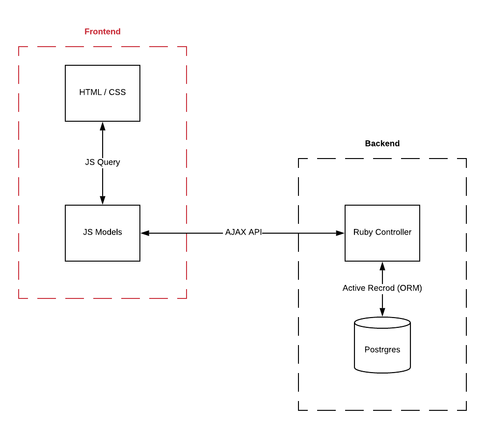

# We are making a web application that allows user's to list spaces they have available, and to hire spaces for the night (whilst obtaining 5000 data points per user)

## Tech

Cambridge Analytica’s AirBnB uses a number of open source projects to work properly:

#### Codebase
* [Ruby/ERB] - For logic and HTML enhanced for web apps!
* [JS] - lightweight scripting language for Web pages!
* [JQuery] - library designed to simplify HTML DOM tree traversal and manipulation.
#### Web Framework
* [Sinatra] - Sinatra is a DSL for quickly creating web applications in Ruby with minimal effort
#### Test Framework
* [Capybara] -  test automation software that simulates scenarios and automates web application testing for BDD
* [Jasmine] - For unit testing purposes.
* [JS Coverage] - For unit test code coverage.
#### Database
* [Postgres] - relational database management system!
* [Table Plus] - GUI tools to create, access, query & edit multiple relational databases

